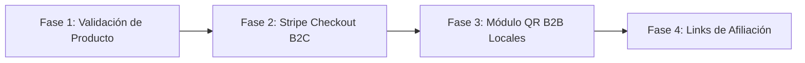

# 💰 Estrategia y Modelo de Monetización: "The Table Companion"
**Proyecto:** LudiClub  
**Estado:** Documento Estratégico de Referencia  
**Última actualización:** Septiembre 2026  

---

## 1. Filosofía de Monetización: Aportar Valor, No Molestar

A diferencia de las aplicaciones tradicionales que saturan la pantalla con banners de Google Ads o que intentan cobrar por funciones esenciales (provocando el rechazo de los usuarios), nuestro modelo sigue la filosofía de **Strava** o **Letterboxd**:

1. **La experiencia básica es 100% gratuita y fluida:** Cualquier grupo de amigos puede usar la Ludoteca Fusionada, votar a qué jugar, registrar la partida y ver quién gana sin pagar nada.
2. **Monetizamos al anfitrión apasionado (B2C):** Cobramos una suscripción asequible a la persona del grupo que valora las estadísticas profundas, la personalización estética y la comodidad.
3. **Monetizamos a los negocios locales (B2B SaaS):** Cobramos a las cafeterías de juegos por resolverles el caos de atender mesas y recomendar juegos.
4. **Comisiones pasivas del sector físico:** Ganamos un porcentaje de las ventas de cajas físicas cuando un grupo decide comprar un juego tras probarlo.

---

## 2. Los 3 Motores de Ingresos

```
┌─────────────────────────────────────────────────────────────────────────────┐
│                       LOS 3 MOTORES DE MONETIZACIÓN                         │
├────────────────────────────────┬────────────────────────────────────────────┤
│ 1. MOTOR B2C (Inmediato)       │ Suscripción "Host Pro" para el anfitrión.  │
│ 2. MOTOR B2B (Exponencial)     │ SaaS "Menú QR" para Bares y Cafeterías.    │
│ 3. MOTOR ECOSISTEMA (Escala)   │ Afiliación de compras y editoriales.       │
└────────────────────────────────┴────────────────────────────────────────────┘
```

---

### Motor 1: Suscripción B2C "Host Pro / Game Master" (Corto Plazo)
*Objetivo: Empezar a generar ingresos recurrentes con los primeros 500-1.000 usuarios activos.*

En casi todo grupo de juegos de mesa existe el arquetipo del **"Game Master / Anfitrión"**: la persona que tiene la casa, colecciona los juegos y lleva el control de las partidas.

#### Precios Sugeridos:
* **Mensual:** 2,99 € / mes.
* **Anual (con descuento):** 24,99 € / año (~2,08 €/mes).

#### Funcionalidades Exclusivas "Host Pro":
1. **Hojas de Puntuación Digitales Inteligentes:**
   - Plantillas de cálculo de puntos automáticas por juego (para no usar papel y lápiz en juegos complejos como *Wingspan*, *7 Wonders*, *Agrícola* o *Terraforming Mars*).
2. **Sincronización Automática con BGG Plays:**
   - Registro de la partida directamente en la cuenta oficial de BoardGameGeek del anfitrión con 1 solo toque al cerrar la partida.
3. **Salón de la Fama y Estadísticas Analíticas Profundas:**
   - Detección de "Némesis" (quién te gana con más frecuencia) y "Víctimas favoritas".
   - Histórico ilimitado de partidas y evolución de win rates por juego y número de jugadores.
   - Gráficos de estilo de jugador y récords históricos de puntos del grupo.
4. **Tarjetas de Victoria HD sin Marca de Agua:**
   - Desbloqueo de temas visuales exclusivos (Cyberpunk, Volcanic, Midnight Gold, Sunset) y exportación en máxima resolución para Instagram Stories y TikTok sin marca de agua de la app.

---

### Motor 2: SaaS B2B para Cafeterías y Bares de Juegos (Medio Plazo / Exponencial)
*Objetivo: Generar ingresos predecibles B2B mientras resolvemos el coste de adquisición de usuarios.*

Las cafeterías y bares de juegos de mesa (*Board Game Cafés*) son un modelo en auge en España y Latinoamérica (ej. *Epic Board Game Bar*, *Replay*, *Six Board Game Café*...).

#### El Dolor del Negocio:
* Tienen estanterías con cientos de juegos.
* Los clientes novatos no saben qué pedir y los camareros pierden entre 10 y 15 minutos en cada mesa explicando opciones.
* No tienen datos reales de qué juegos se desgastan más o cuáles convendría comprar/retirar.

#### Nuestra Solución ("Menú Digital QR para Mesas"):
* Colocamos soportes de madera/acrílico con un código QR en cada mesa del local.
* El cliente escanea el QR desde su navegador y ve la ludoteca del bar con filtros rápidos: *"Somos 2 personas, media hora, para principiantes"*.
* El cliente pide el juego desde la app o avisa al personal.
* Además, los clientes registran sus partidas ahí y siguen usando la app cuando vuelven a sus casas.

#### Modelo de Precios B2B:
* **Plan Local Básico:** 29 € / mes (hasta 200 juegos en catálogo, menú QR digital).
* **Plan Local Pro:** 49 € / mes (catálogo ilimitado, analíticas de rotación de juegos, torneos y branding propio).

#### El Efecto Viral Exponencial:
Cada bar con 20 mesas te aporta entre 150 y 300 usuarios nuevos cada fin de semana **sin gastar 1 euro en publicidad**. El negocio te paga por captar a tus propios clientes.

---

### Motor 3: Afiliación y Ecosistema Editorial (Largo Plazo / Escala)
*Objetivo: Monetizar el flujo de decisión de compra cuando un grupo descubre un juego que le encanta.*

#### 1. Afiliación de Comercio Físico y Online:
* En cada ficha de juego y al pie de cada tarjeta de victoria compartida:
  - Botón discreto: *"¿Quieres este juego para tu ludoteca? Consíguelo en [Tienda local / Zacatrus / Amazon]"*.
* Comisión por venta generada: entre un **5% y un 10%** del valor de la caja (promedio de 2€ - 5€ limpios por compra).

#### 2. Novedades Patrocinadas de Editoriales:
* Editoriales nacionales (Devir, Maldito Games, Tranjis Games, Asmodee) buscan que sus novedades lleguen a la mesa del consumidor.
* Espacio sutil y no intrusivo en el recomendador de *"¿A qué jugamos hoy?"*:
  - *"Novedad recomendada para 4 jugadores este mes: [Título del Juego]"*.

---

## 3. Proyección de Unit Economics (Escenario a 12-18 meses)

| Canal de Ingresos | Volumen Estimado | Ingreso Mensual (MRR) | Ingreso Anual (ARR) |
| :--- | :--- | :--- | :--- |
| **Suscripciones B2C (Host Pro)** | 1.500 suscriptores a 2,49 €/mes | ~3.735 € | ~44.820 € |
| **B2B Locales y Cafeterías** | 60 bares suscritos a 39 €/mes | ~2.340 € | ~28.080 € |
| **Comisiones de Afiliación** | 250 ventas al mes (~4€ comisión media) | ~1.000 € | ~12.000 € |
| **TOTALES ESTIMADOS** | — | **~7.075 € / mes** | **~84.900 € / año** |

---

## 4. Hoja de Ruta Técnica para la Implementación de Pagos



1. **Fase 1 (Actual):** Consolidar la experiencia gratuita del grupo de juego, el selector *"¿A qué jugamos hoy?"* y las tarjetas para WhatsApp para maximizar la retención orgánica.
2. **Fase 2:** Integración de **Stripe Customer Portal** con Supabase Auth para gestionar la suscripción `is_premium` (ya contemplada en la base de datos `users.is_premium`).
3. **Fase 3:** Desarrollo de la vista `/venue/:slug` para el menú QR de locales asociados con panel de control para el dueño del bar.
4. **Fase 4:** Integración de IDs de afiliado en las llamadas a fichas de juegos y enlaces de compra.
